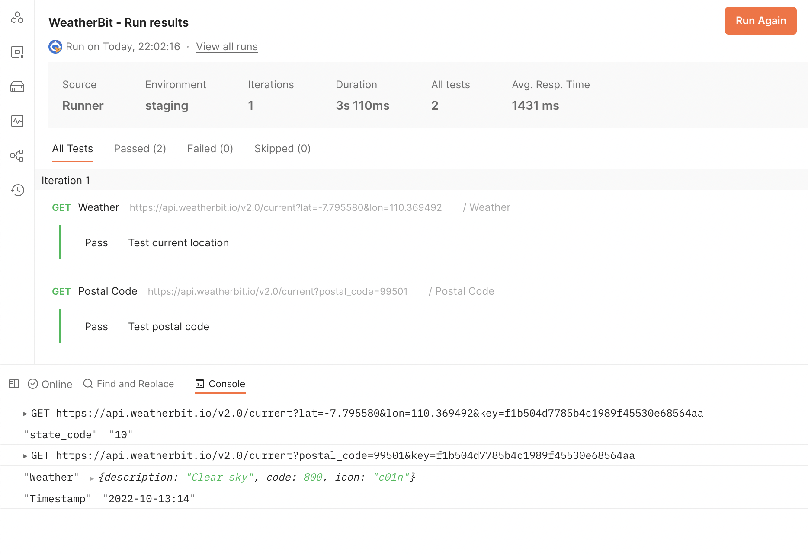
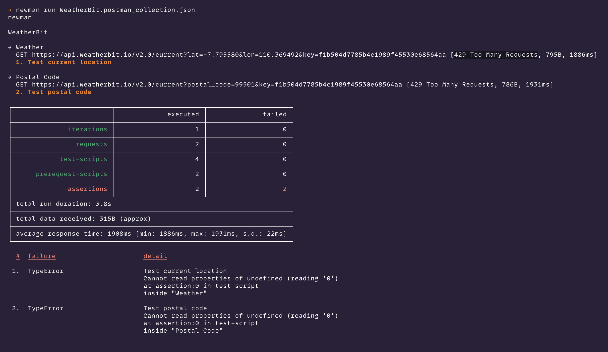

# Getting Started

## WeatherBit API Testing

### Menggunakan Postman

1. Buka file `WeatherBit.postman_collection.json`
2. Ubah bagian `KEY_ANDA_DISINI` dengan API key yang bisa Anda dapatkan dari https://www.weatherbit.io/account/create
```
"variable": [
		{
			"key": "key",
			"value": "KEY_ANDA_DISINI",
			"type": "string"
		}
	]
```

3. Import JSON collection `WeatherBit.postman_collection.json` ke Postman (File > Import...)
4. Buka Postman Console untuk melihat output.
5. Eksekusi collection tersebut satu-satu atau dengan menggunakan Run Collection seperti yang terlihat pada screenshot.



### Menggunakan Newman

1. Pastikan Anda telah memasang Node.js
2. Install [newman](https://www.npmjs.com/package/newman) secara global dengan menggunakan perintah `npm install -g newman`
3. Jalankan perintah berikut untuk mengeksekusi test
```
newman run WeatherBit.postman_collection.json
```



## Automated UI Testing

1. Pastikan telah menjalankan perintah `npm install`.
2. Jalankan perintah `node ui-testing.js`
